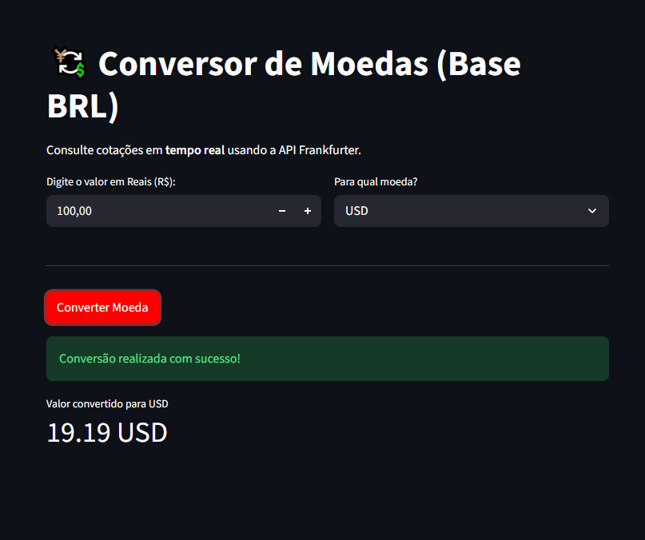

# Real-Time Currency Converter (BRL Base)

    

A real-time currency converter built with **Python and Streamlit**, using live exchange-rate data from the [Frankfurter API](https://api.frankfurter.dev/).

The project uses a **modular multi-interface architecture**, keeping the currency-conversion logic and HTTP integration separate from the user interfaces.

The same core functionality can be accessed through either a **command-line interface (CLI)** or an interactive **Streamlit web interface** without duplicating the conversion logic.



<p align="center">
  <em><strong>Figure 1.</strong> Streamlit interface consuming live exchange-rate data through the shared currency-conversion module.</em>
</p>

## Architecture

```text
                     Currency Converter
                            |
                            v
                  currency_converter.py
                  Conversion + API Logic
                            |
               +------------+------------+
               |                         |
               v                         v
           main.py                     app.py
             CLI                     Streamlit
               |                         |
               +------------+------------+
                            |
                            v
                     Frankfurter API
```

## How It Works

### Shared conversion core

The central module:

```text
currency_converter.py
```

contains the currency-conversion logic and communication with the external API.

Keeping this logic independent from the presentation layer allows both interfaces to reuse the same implementation.

### Command-Line Interface

The CLI is available through:

```text
main.py
```

It provides a lightweight terminal-based way to execute currency conversions without starting a web interface.

### Streamlit Interface

The web interface is implemented in:

```text
app.py
```

It allows the user to:

- enter an amount in Brazilian reais;
- select the destination currency;
- request the conversion;
- view the converted value directly in the browser.

The interface delegates the actual conversion logic to the shared core module instead of implementing API communication independently.

## Reliability and Error Handling

The HTTP integration includes defensive handling for external-service failures.

The implementation uses:

- request timeouts;
- response validation;
- JSON key validation;
- exception handling around API calls.

These checks reduce the risk of the application failing unexpectedly when the external API is unavailable or returns an unexpected response.

## Project Structure

```text
conversor_moedas/
├── img/
│   └── app-interface.png
├── app.py
├── currency_converter.py
├── main.py
├── pyproject.toml
├── uv.lock
├── README.md
├── LICENSE
└── .gitignore
```

## Tech Stack

| Layer | Technology |
|---|---|
| Language | Python |
| Web interface | Streamlit |
| External data | Frankfurter API |
| HTTP integration | requests |
| Dependency management | uv |
| Version control | Git + GitHub |

## Running Locally

### 1. Clone the repository

```bash
git clone https://github.com/priscilamestra/conversor_moedas.git
cd conversor_moedas
```

### 2. Install dependencies

```bash
uv sync
```

### 3. Run the Streamlit interface

```bash
uv run streamlit run app.py
```

The application will be available locally at:

```text
http://localhost:8501
```

### 4. Run the CLI

```bash
uv run python main.py
```

## What This Project Demonstrates

This project demonstrates:

- Python application structure;
- separation of concerns;
- reusable business logic;
- multiple interfaces sharing the same core;
- REST API consumption;
- HTTP request handling;
- Streamlit application development;
- defensive error handling;
- dependency management with uv;
- Git-based development workflow.

## License

This project is licensed under the **MIT License**.